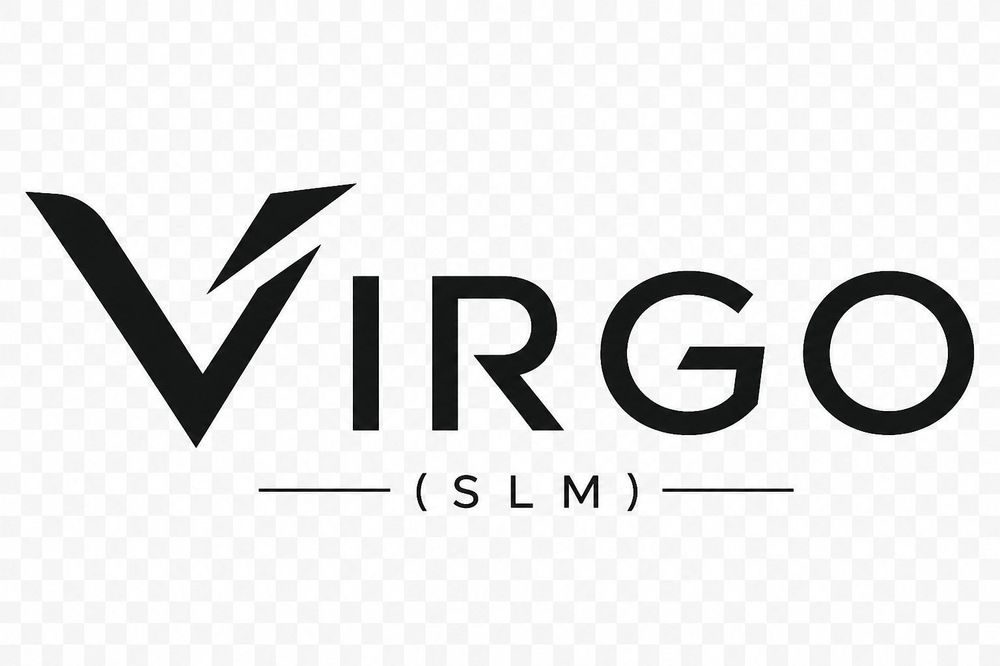
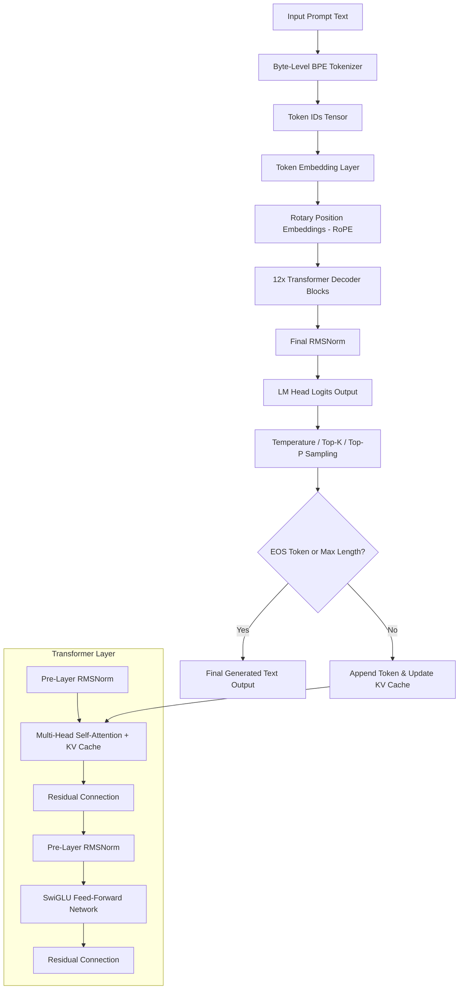

<div align="center">

  

  # ♍ Virgo SLM V1.0

  **A 120M Parameter Small Language Model Built Completely From Scratch**

  *“Not Everybody Needs The Blueprint.”*

  [](https://opensource.org/licenses/MIT)
  [](https://www.python.org/)
  [](https://pytorch.org/)
  [](https://www.kaggle.com/models/punitkashyap2007/virgo-instruct)
  [](https://github.com/Punit-Kumar-Kashyap)
  [](https://www.iitdh.ac.in/)

</div>

---

## 📖 Table of Contents
- [📢 An Honest Confession & Transparency Notice](#-an-honest-confession--transparency-notice)
- [📦 Official Model Weights on Kaggle Models](#-official-model-weights-on-kaggle-models)
- [✨ Key Features & Technical Highlights](#-key-features--technical-highlights)
- [🧠 Model Architecture & Specifications](#-model-architecture--specifications)
- [🔄 Virgo Inference Cycle Architecture](#-virgo-inference-cycle-architecture)
- [📐 Mathematical Foundations](#-mathematical-foundations)
- [🚀 Quick Start & Installation](#-quick-start--installation)
- [💻 Usage & Inference Examples](#-usage--inference-examples)
- [📓 Research & Training Notebooks](#-research--training-notebooks)
- [📁 Repository Structure](#-repository-structure)
- [📊 Capabilities & Known Limitations](#-capabilities--known-limitations)
- [🌌 Future Roadmap](#-future-roadmap)
- [📜 Citation](#-citation)
- [📄 License & Author](#-license--author)

---

## 📢 An Honest Confession & Transparency Notice

> [!IMPORTANT]
> **Reality Check & Project Philosophy**  
> **Virgo SLM V1.0** is an open-source 120 Million Parameter Small Language Model engineered entirely from scratch by **Punit Kumar Kashyap** (First-Year Undergraduate, Department of Engineering Physics at **IIT Dharwad**) as a self-directed learning exploration into modern generative AI architectures.
>
> **Let's be 100% transparent about the model's capabilities**:
> - **It is NOT a frontier LLM**: Virgo (120M parameters) is tiny compared to multi-billion parameter models (like Llama-3 70B, GPT-4, or Claude 3.5).
> - **Real-world Limitations**: Virgo struggles with complex multi-step math, multi-turn long context retention beyond 1024 tokens, and advanced logical reasoning. If prompts are underspecified or generation bounds are set too small (< 64 tokens), it may hallucinate or generate repetitive loops.
> - **Why this project exists**: The primary value of Virgo is **100% educational and structural transparency**. It demonstrates how to build a complete, functional decoder-only Transformer pipeline—from raw Byte-Pair Encoding (BPE) tokenization and custom PyTorch components (RoPE, RMSNorm, SwiGLU) to pre-training, instruction fine-tuning, KV-cached inference, and web deployment—from absolute zero.

---

## 📦 Official Model Weights on Kaggle Models

All official model checkpoints for the Virgo family are hosted publicly on **Kaggle Models**:

| Model Variant | Description | Kaggle Hub Release Link |
| :--- | :--- | :--- |
| 🎯 **Virgo Instruct** | Instruction-following model fine-tuned for prompt execution | [kaggle.com/models/punitkashyap2007/virgo-instruct](https://www.kaggle.com/models/punitkashyap2007/virgo-instruct) |
| 💬 **Virgo Chat** | Multi-turn dialogue conversational alignment checkpoint | [kaggle.com/models/punitkashyap2007/virgo-chat](https://www.kaggle.com/models/punitkashyap2007/virgo-chat) |
| ⚡ **Virgo Align V1.0** | Preference and fine-grained alignment release | [kaggle.com/models/punitkashyap2007/virgo-align-v1-0](https://www.kaggle.com/models/punitkashyap2007/virgo-align-v1-0) |
| 📦 **Virgo Base V1.0** | Raw pre-trained base model checkpoint (120M) | [kaggle.com/models/punitkashyap2007/virgo-base-v1-0](https://www.kaggle.com/models/punitkashyap2007/virgo-base-v1-0) |

---

## ✨ Key Features & Technical Highlights

- **Built 100% From Scratch**: Pure PyTorch implementation of every Transformer building block without third-party framework wrappers.
- **Custom BPE Tokenizer**: 45,000 Byte-Level Byte-Pair Encoding (BPE) vocabulary (`tokenizer.json` / `virgo_tokenizer.json`) tailored for code syntax, mathematical expressions, and natural text.
- **Modern Decoder-Only Architecture**: Rotary Position Embeddings (RoPE), pre-layer RMSNorm, and SwiGLU Feed-Forward Networks.
- **Fast KV-Cached Inference**: Low-latency PyTorch inference engine with Key-Value caching, Top-K/Top-P sampling, and repetition penalty controls.
- **Interactive Web Studio**: Glassmorphism-themed FastAPI + Vanilla JS web interface with dark mode, prompt category cards, and model engine switcher.
- **21 Research Notebooks**: Comprehensive set of Jupyter notebooks documenting pre-training, tokenization, dataset generation, dialogue alignment, and instruct tuning.

---

## 🧠 Model Architecture & Specifications

| Hyperparameter | Specification |
| :--- | :--- |
| **Model Name** | Virgo SLM V1.0 |
| **Architecture** | Decoder-only Transformer |
| **Total Parameters** | ~120 Million (120,458,752) |
| **Hidden Dimension (`d_model`)** | 768 |
| **Transformer Layers (`n_layer`)** | 12 |
| **Attention Heads (`n_head`)** | 12 |
| **Head Dimension (`d_head`)** | 64 |
| **Feed-Forward Dim (`d_ff`)** | 3,072 (SwiGLU) |
| **Vocabulary Size** | 45,000 (Byte-Level BPE) |
| **Max Context Length** | 1,024 Tokens |
| **Position Embeddings** | RoPE (Rotary Position Embeddings) |
| **Normalization** | Pre-Layer RMSNorm |

---

## 🔄 Virgo Inference Cycle Architecture



---

## 📐 Mathematical Foundations

### 1. Root Mean Square Normalization (RMSNorm)
Instead of standard LayerNorm, Virgo uses **RMSNorm** for faster computation and training stability:
$$\text{RMSNorm}(x) = \frac{x}{\sqrt{\frac{1}{d} \sum_{i=1}^d x_i^2 + \epsilon}} \odot \gamma$$

### 2. SwiGLU Activation Function
The Feed-Forward Network utilizes **SwiGLU** (Swish Gated Linear Unit) instead of traditional GELU/ReLU:
$$\text{SwiGLU}(x) = \left( \text{Swish}(x W_g) \odot x W_v \right) W_o$$
$$\text{where } \text{Swish}(x) = x \cdot \sigma(x)$$

### 3. Rotary Position Embeddings (RoPE)
Positions are encoded directly into Query ($Q$) and Key ($K$) representations via complex vector rotation:
$$R_{\Theta, m}^d = \text{diag}\left( R_{\theta_1, m}, R_{\theta_2, m}, \dots, R_{\theta_{d/2}, m} \right)$$

---

## 🚀 Quick Start & Installation

### 1. Clone the Repository
```bash
git clone https://github.com/punitxdev/VIRGO-SLM.git
cd Virgo
```

### 2. Create & Activate Virtual Environment
```bash
python3 -m venv venv
source venv/bin/activate  # On Windows: venv\Scripts\activate
```

### 3. Install Dependencies
```bash
pip install -r requirements.txt
```

---

## 💻 Usage & Inference Examples

### Quick Python Inference
Generate responses programmatically using `examples/inference.py`:

```python
import torch
from webapp.model import FastVirgoModel, VirgoConfig

# 1. Initialize architecture configuration
config = VirgoConfig(
    vocab_size=45000,
    block_size=1024,
    n_layer=12,
    n_head=12,
    n_embd=768
)

# 2. Load PyTorch model state
model = FastVirgoModel(config)
checkpoint = torch.load("trained_models/virgo_instruct.pt", map_location="cpu")
model.load_state_dict(checkpoint if isinstance(checkpoint, dict) else checkpoint.state_dict())
model.eval()

# 3. Perform inference
prompt = "Write a Python binary search function."
print(f"Prompt: {prompt}")
```

### Interactive CLI Chatbot
```bash
python examples/chatbot.py
```

### Launch Web Studio UI
```bash
uvicorn webapp.main:app --host 0.0.0.0 --port 8000 --reload
```
Open **`http://localhost:8000`** in your browser to access the interactive web studio.

---

## 📓 Research & Training Notebooks

This project includes 21 comprehensive Jupyter Notebooks documenting every stage of research:

| Notebook | Focus Area |
| :--- | :--- |
| `notebooks/Virgo_Demo.ipynb` | Quickstart interactive walkthrough |
| `notebooks/virgo-slm-v1.ipynb` | Architecture exploration & parameter sizing |
| `notebooks/virgo-preprocessing.ipynb` | Data cleaning & text normalization pipeline |
| `notebooks/virgo-general-tokenize.ipynb` | 45K BPE Vocabulary training |
| `notebooks/virgo_genral_training.ipynb` | Virgo Base 120M autoregressive pre-training |
| `notebooks/virgo-chat-training.ipynb` | Multi-turn dialogue alignment |
| `notebooks/virgo-instruction-fine-tune.ipynb` | Instruct post-training pass |

---

## 📁 Repository Structure

```
Virgo/
├── README.md                 # Main Project Documentation
├── LICENSE                   # MIT License
├── CHANGELOG.md              # Semantic Version History (v1.0.0)
├── ROADMAP.md                # Interactive Development Roadmap
├── CONTRIBUTING.md           # Student & Researcher Contribution Guide
├── CODE_OF_CONDUCT.md        # Contributor Covenant Code of Conduct
├── SECURITY.md               # Security Vulnerability Policy
├── MODEL_CARD.md             # Model Card & Technical Specifications
├── CITATION.cff              # Citation File Format
├── requirements.txt          # Python Dependencies
├── .gitignore                # Git Ignore Rules
│
├── docs/                     # Detailed Technical Documentation
│   ├── architecture.md       # Transformer Model Architecture Deep Dive
│   ├── tokenizer.md          # 45K BPE Tokenizer Design
│   ├── training.md           # Pre-training & Instruct Tuning Pipeline
│   └── inference.md          # KV Caching & Generation Sampling Logic
│
├── model/                    # Model Weights & Tokenizer Files
│   ├── config.json           # Model Hyperparameters
│   ├── tokenizer.json        # Fast BPE Tokenizer Vocabulary
│   ├── virgo_tokenizer.json  # Custom Virgo BPE Vocabulary
│   ├── tokenizer_config.json # Tokenizer Metadata
│   └── special_tokens_map.json # Special Tokens Map
│
├── tokenizer/                # Standalone Custom Tokenizer Directory
│   └── virgo_tokenizer.json  # 45K Byte-Level BPE JSON
│
├── examples/                 # Ready-to-run Example Scripts
│   ├── inference.py          # Standalone Text Generation
│   ├── chatbot.py            # Terminal Interactive Chatbot
│   └── generation.py         # Batch Sampling & Benchmark Test
│
├── configs/                  # Modular YAML Configuration Files
│   ├── model_config.yaml     # Architecture Parameters
│   ├── tokenizer_config.yaml # BPE Tokenizer Specs
│   └── training_config.yaml  # Training Hyperparameters
│
├── scripts/                  # Model Pipeline Entry Scripts
│   ├── train.py              # PyTorch Training Loop
│   ├── preprocess.py         # Tokenization Pipeline
│   ├── evaluate.py           # Perplexity Evaluation
│   └── benchmark.py          # Benchmarking Suite
│
├── notebooks/                # 21 Research & Training Notebooks
│   ├── Virgo_Demo.ipynb      # Interactive Quickstart Walkthrough
│   └── ...                   # Full set of research notebooks
│
├── webapp/                   # Full FastAPI + Vanilla JS Web Studio
│   ├── main.py               # FastAPI server entry point
│   ├── inference.py          # Inference engine runner
│   ├── model.py              # PyTorch model definition
│   └── static/               # HTML5, CSS3 glassmorphism & JavaScript
│
└── assets/                   # Visual Assets
    └── logo.png
```

---

## 📊 Capabilities & Known Limitations

### Strengths
- **Clean Algorithm Generation**: Generates concise Python functions (binary search, sorting), SQL queries, and basic algorithms.
- **Factual Definitions**: Good performance on basic physics, chemistry, and general computer science concepts.
- **Ultra-Fast Local Speed**: 120M parameter footprint runs smoothly on standard consumer CPUs and low-tier GPUs without heavy memory requirements.

### Limitations
- **Arithmetic & Complex Logic**: Limited precision on multi-digit mathematical calculations.
- **Strict Token Bounds**: Under tight generation limits (e.g. < 64 tokens), the model may enter repetitive loops if an `<eos>` token is not emitted early.
- **Context Capacity**: Limited to a maximum sequence context window of 1,024 tokens.

---

## 🌌 Future Roadmap

- [x] **Virgo Base V1.0 (120M)** — 12-layer decoder-only transformer pre-trained from scratch.
- [x] **Virgo Chat** — Multi-turn dialogue conversational alignment.
- [x] **Virgo Align V1.0** — Preference alignment pass.
- [x] **Virgo Instruct** — Instruction-following post-training.
- [ ] **Virgo 350M & 1B** — Scaled architecture expansion.
- [ ] **Virgo Multimodal** — Vision-language embedding alignment.

---

## 📜 Citation

If you use Virgo in your research, academic work, or educational exploration, please cite it as follows:

```bibtex
@misc{virgo2026,
  author = {Punit Kumar Kashyap},
  title = {Virgo SLM V1.0: A 120M Parameter Small Language Model Built From Scratch},
  year = {2026},
  publisher = {GitHub},
  journal = {GitHub Repository},
  howpublished = {\url{https://github.com/punitxdev/VIRGO-SLM}},
  institution = {Indian Institute of Technology Dharwad}
}
```

---

## 📄 License & Author

This project is licensed under the **MIT License** - see the [LICENSE](LICENSE) file for details.

**Punit Kumar Kashyap**  
*First-Year Undergraduate, Department of Engineering Physics*  
*Indian Institute of Technology Dharwad*  
- **GitHub**: [@Punit-Kumar-Kashyap](https://github.com/Punit-Kumar-Kashyap)  
- **Kaggle**: [@punitkashyap2007](https://www.kaggle.com/punitkashyap2007)  
- **Project Repo**: [Virgo SLM](https://github.com/punitxdev/VIRGO-SLM)
