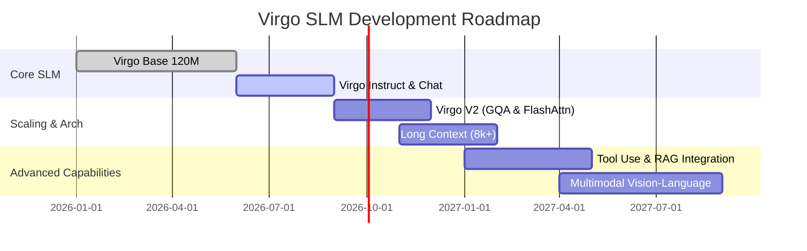

# 🗺️ Virgo Project Roadmap

The development of **Virgo** is structured around iterative milestones, moving from foundational architecture implementation to specialized fine-tuning, efficiency optimizations, and multimodal extensions.

---

## 🎯 Milestone Status

- [x] **Virgo Base (120M)** — 120M Parameter decoder-only baseline trained from scratch.
- [x] **Virgo Chat** — Conversational fine-tuning pass for natural multi-turn dialogue.
- [x] **Virgo Instruct** — Instruction-following post-training (Epoch 1 & Epoch 2 alignment).
- [ ] **Virgo V2** — Architecture upgrades (FlashAttention, Grouped-Query Attention).
- [ ] **Larger Virgo Models** — Scaling up to 350M and 1B parameter variants.
- [ ] **Long Context Window** — Expanding context size from 1,024 to 8,192+ tokens via RoPE scaling.
- [ ] **Better Reasoning** — Dedicated mathematical and algorithmic synthetic data training passes.
- [ ] **Tool Use** — Function calling and API execution integration.
- [ ] **RAG (Retrieval-Augmented Generation)** — Embedded retrieval engine for external knowledge bases.
- [ ] **Virgo Multimodal** — Vision-language embedding alignment for multimodal inputs.

---

## 📅 Detailed Release Plan

---

## 🤝 How to Influence the Roadmap

As an educational and open-source project, community input is essential! If you have suggestions for features, architecture tweaks, or benchmark suites:
- Open a feature request in [GitHub Issues](https://github.com/punitxdev/VIRGO-SLM/issues)
- Join the discussion in [Pull Requests](https://github.com/punitxdev/VIRGO-SLM/pulls)
